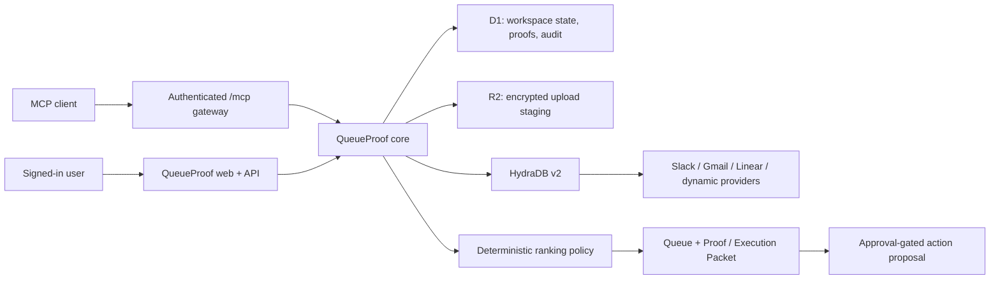

# QueueProof architecture

## Trust and data flow

Provider content is evidence, never instruction. QueueProof does not let retrieved text alter system policy, expand permissions, select an MCP workspace, or execute a provider write.

## Modules

- `packages/hydradb`: exact raw HTTP contract using `https://api.hydradb.com`, Bearer authentication, and `API-Version: 2`.
- `packages/connectors`: provider-agnostic catalogue/descriptor/discovery/configuration adapter.
- `packages/retrieval`: deterministic routing between fast and thinking query modes.
- `packages/ranking`: bounded 100-point policy, penalties, comparisons, and counterfactuals.
- `packages/contracts`: Zod schemas at API, MCP, ranking, source, and execution boundaries.
- `packages/security`: redaction, export sanitisation, prompt-injection detection, SSRF URL policy.
- `packages/mcp`: workspace-bound MCP server; read tools and proposal tools are distinctly annotated.
- `lib/server`: identity, D1 store, credential envelopes, runtime bindings, audit helpers.

## Persistence

D1 stores identity, workspaces, encrypted credential envelopes, provider contract hashes, connector state, resource selections, verification receipts, queries, sources, queue snapshots, ranking explanations, conflicts, commitments, memories, skill versions, approvals, action proposals, MCP clients, evaluations, traces, costs, and audit events. Every operational row is workspace-owned. R2 is reserved for upload staging before HydraDB ingestion.

The checked-in migration is `drizzle/0000_bent_living_mummy.sql`. There is no fixture fallback when D1 or HydraDB is unavailable.

## State invariants

“Connected” is never inferred from a saved credential. A connector reaches `data_verified` only after provider object inspection and a canary query returns source content attributable to that provider. A sync request does not prove sync completion. Production queue screens remain empty until grounded source evidence exists.
