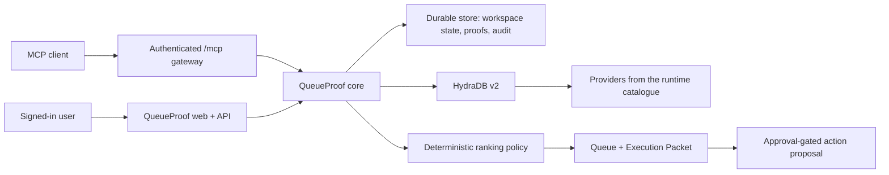

# QueueProof architecture

> [!WARNING]
> **SUPERSEDED — HISTORICAL ARCHITECTURE SNAPSHOT.** This root-level document describes an
> earlier implementation and includes defects and missing capabilities that may since have
> changed. It is retained for provenance, not release truth. Use
> [`docs/ARCHITECTURE.md`](docs/ARCHITECTURE.md) for the maintained architecture and
> [`RELEASE_EVIDENCE.md`](RELEASE_EVIDENCE.md) for candidate/deployment identity.

## Trust and data flow

Provider content is evidence, never instruction. Retrieved text is not allowed to alter
system policy, expand permissions, select an MCP workspace, or execute a provider write.

## Modules

- `packages/hydradb`: raw HTTP contract against `https://api.hydradb.com`, Bearer
  authentication, `API-Version: 2`.
- `packages/connectors`: provider-agnostic catalogue, descriptor, discovery, and
  configuration adapter. This package contains no provider-specific code; providers are
  expected to arrive from the runtime catalogue. Provider names do appear elsewhere as
  plain keyword regexes (query-mode routing in `packages/retrieval`, generic-title
  stripping in `lib/server/queue.ts`) and in UI example copy. Those are string matches,
  not integrations.
- `packages/retrieval`: deterministic routing between fast and thinking query modes.
- `packages/ranking`: bounded 100 point policy with nine positive components, a penalty
  map, and comparison. A counterfactual helper exists and is unit tested, but no
  production code path calls it.
- `packages/contracts`: Zod schemas at the API, MCP, ranking, source, and execution
  boundaries, including the 14 state connector state machine.
- `packages/security`: redaction, export sanitisation, prompt-injection detection, SSRF
  URL policy.
- `packages/mcp`: workspace-bound MCP server. Fourteen tools are registered; scope gating
  at registration time means an app-issued read-only token is never offered the propose or
  sync tools. The static fallback credential in `app/mcp/route.ts` authenticates without a
  stored token row and keeps the default full scope set, so scope narrowing applies to
  app-issued tokens only. The server also still registers resources named
  `queueproof-skills` and `queueproof-policies` whose backing tables are neither in the
  read allowlist nor created by the schema, so reading them errors.
- `lib/server`: identity, storage facade, credential envelopes, runtime bindings, queue
  generation, audit helpers.

## Runtime bindings

Two runtimes resolve bindings differently, and this is the main thing to understand
before reading `lib/server`.

- **Vite dev and the Cloudflare Worker** use `lib/server/runtime-provider.ts`, which reads
  `cloudflare:workers`. In `npm run dev` the D1 and R2 bindings are emulated by Miniflare
  through `@cloudflare/vite-plugin`, with state under `.wrangler/`.
- **Vercel** builds with `next build --webpack`, which aliases `runtime-provider.ts` to
  `lib/server/runtime-vercel.ts`. That path has no Cloudflare bindings, so storage is
  resolved by `lib/server/d1-compat.ts`.

`lib/server/d1-compat.ts` reimplements exactly the D1 statement surface the codebase uses
(`prepare`/`bind`/`first`/`all`/`run`/`batch`, with atomic batches) over two backends:
hosted libSQL/Turso over the HTTP pipeline API (`TURSO_DATABASE_URL`,
`TURSO_AUTH_TOKEN`), and `node:sqlite` for local and CI use
(`QUEUEPROOF_SQLITE_PATH`). Only the methods QueueProof actually calls are implemented;
anything else throws rather than returning a wrong shape.

## Persistence

`ensureCoreSchema` in `lib/server/store.ts` creates the 23 tables the running product
actually uses: `users`, `workspaces`, `workspace_members`, `hydradb_accounts`,
`connectors`, `connector_providers`, `connector_resources`, `connection_verifications`,
`source_references`, `task_candidates`, `task_evidence`, `ranking_runs`, `ranking_items`,
`queue_snapshots`, `execution_packets`, `execution_events`, `action_proposals`,
`action_approvals`, `action_executions`, `query_runs`, `mcp_clients`, `mcp_tokens`, and
`audit_events`. Every operational row is workspace-owned.

The checked-in migration `drizzle/0000_bent_living_mummy.sql` is broader than that. It
declares tables for capabilities that are **not built**, including `memories`,
`memory_versions`, `skills`, `skill_versions`, `skill_proposals`, `eval_suites`,
`eval_cases`, `eval_runs`, `eval_results`, `ranking_policies`, `conflicts`,
`commitments`, and `execution_packet_leases`. Nothing reads or writes them at runtime.
Treat the migration as an aspirational schema, not as evidence of a feature. This is also
why the MCP server can advertise resources whose tables the runtime never creates.

There is no fixture fallback when storage or HydraDB is unavailable; the app reports
`not_ready` and names the missing configuration instead.

The R2 binding (`FILES`) is declared and is present in the Cloudflare and dev runtimes,
but nothing writes to it. There is no upload, staging, or document ingestion code in the
repository. Readiness checks the binding only because the Worker deployment declares it.

That check is a known defect on Vercel. `app/api/health/ready/route.ts` requires
`uploadBinding`, which resolves from the Cloudflare `FILES` binding, and the Vercel
runtime has no Cloudflare bindings. So `/api/health/ready` returns 503 on Vercel even when
storage and the encryption key are correctly configured. The user-facing screen is gated
on storage availability instead, so a configured deployment still works while readiness
misreports it. Readiness should be split per runtime, or drop the upload check until an
upload path exists.

## Evidence graph

`packages/graph` derives a small node/edge graph at read time, never persisted. Two
pairs of entry points, grouped by what they read:

- `deriveGraphFromPacket` / `deriveGraphFromAskResult` read an already-produced
  `ExecutionPacket` or `/api/ask` response, exposed read-only at `GET /api/graph`. They
  are computed from `task_evidence` / `execution_packets` / synthesis contradiction
  output and returned; nothing about it is written to storage. Regenerating the queue
  or re-asking a question produces a different graph on the next `GET`, the same way
  the packet and the ask response it reads from can change.
- `deriveGraphFromConnectors` / `deriveGraphFromActionProposal` read live
  `connectors` / `source_references` rows and `action_proposals` /
  `action_approvals` / `action_executions` rows directly, because neither
  `sourceReferenceSchema` nor `ExecutionPacket` carries a `connectorId` or an
  `action_proposals.id` — see the doc comments on each function in
  `packages/graph/src/index.ts` for exactly which field is dropped where.
  `deriveGraphFromConnectors` **is** wired in: `GET /api/graph` queries `connectors`
  and `source_references` directly (two extra `SELECT`s, workspace-scoped) and merges
  in `connector` nodes plus `ORIGINATED_FROM` edges for any source the packet/ask
  derivation already produced. `deriveGraphFromActionProposal` is **not** wired in — it
  needs a joined `action_proposals`/`action_approvals`/`action_executions` query the
  route doesn't run yet, so `approval` and `receipt` nodes exist in code and are unit
  tested, but never appear in a live `GET /api/graph` response today. The Evidence tab's
  `EvidenceGraph.tsx` component reflects this honestly: its `COLUMN_ORDER` includes
  `connector` (real, rendered) but omits `approval`/`receipt` (would render as a
  permanently empty column, since the component draws one label per configured type
  regardless of whether any node of that type exists).

Eight node types, seven edge types, every one traceable to a field that already exists
at runtime:

- `source` — one per `evidence`/`citations`/`source_references` item
  (`sourceReferenceSchema` / `groundedCitationSchema`, `packages/contracts/src/index.ts`,
  or a raw `source_references` row).
- `claim` — one per `/api/ask` `claims[]` entry. Packets carry no claims (only
  `synthesiseGroundedAnswer`'s output does), so this node type is only ever produced
  by `deriveGraphFromAskResult`.
- `contradiction` — one per recognisable entry in `contradictions`. Both the packet and
  the ask-result schema type this field `z.unknown()`; at runtime both are populated
  from the same `{ summary, evidenceIds, providers }` shape
  (`lib/server/synthesis.ts`'s `contradictions()`, `lib/server/queue.ts`'s
  `clusterContradictions()`), which is read defensively rather than trusted.
- `task` — one per packet, or one per `/api/ask` `priority_items[]` entry (there are
  normally zero or one, since `app/api/ask/route.ts` caps `relatedPriority` at one).
- `action` — one per non-empty `recommended_safe_action` /
  `recommended_next_safe_action` (from a packet/ask-result), or one per real
  `action_proposals` row (from `deriveGraphFromActionProposal`), with a `RESOLVES` edge
  from its task in the packet/ask-result case.
- `connector` — one per real `connectors` row (`db/schema.ts`), carrying the actual
  14-state `ConnectorState` (`packages/contracts`'s `connectorStateSchema`).
- `approval` — one per real `action_approvals` row, which is 1:1 with its
  `action_proposals` row (`uniqueIndex("action_approvals_proposal_uq")`).
- `receipt` — one per `action_executions` row that reports `status === "succeeded"`
  with a non-empty `provider_response_id` — the real external write confirmation
  (`app/api/actions/[id]/approve/route.ts` only sets it after the provider call
  returns an id). A pending or failed execution produces no receipt node.

Edges: `SUPPORTS` (source → task/claim/action, mirroring the `task_evidence.relation`
column, which is always `'supports'` in the schema default and in every insert
`lib/server/queue.ts` performs — there is no evidence-to-task `REFUTES` relation in the
real data, so none is derived), `REFUTES` (source → contradiction), `RESOLVES`
(task → action), `ORIGINATED_FROM` (source → connector, from `source_references`'s real
`connector_id` foreign key), `REQUIRES_APPROVAL` (action → approval),
`EXECUTED_AS` (action → receipt). `DEPENDS_ON` is declared in the type union but never
emitted: the `task_dependencies` and `entity_links` tables in `db/schema.ts` are
dormant — like the other tables `## Persistence` lists as aspirational, nothing reads
or writes them at runtime — so there is no real dependency edge for this to represent
yet. `why_above_next` is not represented either; it compares this task's score against
a different task's, which is not a dependency between them.

Deliberately not modelled, with the reason:

- `SUPERSEDES` — `lib/server/synthesis.ts`'s `valuePatternsForQuestion` can detect
  supersession language ("supersed…", "no longer in force") well enough to surface the
  sentence as a claim, but it identifies a *phrase*, not a specific prior claim/evidence
  id being superseded. There is no second endpoint to point the edge at without
  inventing one, so no `SUPERSEDES` edge type exists.
- `DUPLICATES` — `RankingInput.penalties.duplicate` (`packages/contracts`) is
  hardcoded to `0` in `lib/server/queue.ts`'s `rankingInput()` and never computed
  anywhere. The actual duplicate handling happens earlier, in
  `clusterTaskEvidence`/`attachUnambiguousDocumentEvidence`, which merges duplicate
  evidence into one task's cluster before ranking — so by the time a graph is derived,
  duplicates already show up as multiple `source` nodes `SUPPORTS`-ing one `task`, not
  as two distinct task nodes that would need a `DUPLICATES` edge between them.
- `Person`/`Organization` — `task.owner` and similar fields are free text with no
  canonical entity resolution; `canonical_entities`/`entity_aliases`/`entity_links` are
  declared in `db/schema.ts` but dormant, same as `commitments`. No exact id, no node.
- `Commitment`/`Decision` — not distinct from the existing `task`/`claim` nodes in this
  codebase; the `commitments` table exists in `db/schema.ts` but nothing reads or
  writes it at runtime (confirmed: no `FROM commitments` / `INTO commitments` query
  anywhere), and there is no `decisions` table at all.
- `BenchmarkCase` — `evals/fixtures/*.json` and `evals/results/*.json` are real, but
  they are a build-time evaluation artifact with no `workspace_id` and no relation to
  a workspace's runtime evidence graph. Out of scope for this module.
- `Workspace`, `Document`, `Chunk`, `Ticket`, `Commit`, `PullRequest`, `Thread` — each
  would either be a single, edge-free node repeated on every graph (`Workspace`), or a
  relabelling of the existing `source` node by `provider` string with no new field
  behind it (a HydraDB chunk has no persisted identity once it is folded into
  `evidence.excerpt`; a Linear/GitHub/Slack record is already a `source` node with
  `provider` set to that name).

## State invariants

"Connected" is never inferred from a saved credential. A connector reaches
`data_verified` only after provider object inspection and a canary query returns source
content attributable to that provider. A sync request does not prove sync completion.
Queue screens stay empty until grounded source evidence exists.

Credentials are encrypted with AES-GCM using a random IV per secret, keyed by a SHA-256
digest of `QUEUEPROOF_ENCRYPTION_KEY`. The browser only ever receives a 16 character
fingerprint. MCP tokens are shown once and stored only as a hash, with an audience, an
expiry, and explicit scopes.
