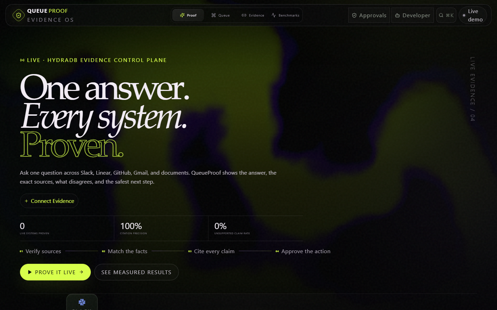

# QueueProof

**One answer. Every system. Proven.**

QueueProof is an evidence-backed control plane for autonomous work. It retrieves work
evidence through HydraDB, produces cited answers, compiles a deterministic next-action
queue, and keeps external writes behind an approval boundary.

- Live product: <https://queueproof.vercel.app>
- Direct demo: <https://queueproof.vercel.app/demo>
- Method: <https://queueproof.vercel.app/method>
- Measured results: <https://queueproof.vercel.app/benchmarks>
- Repository: <https://github.com/vaibhav4046/queueproof>
- Canonical demo: [docs/DEMO_SCRIPT_60S.md](docs/DEMO_SCRIPT_60S.md)
- Judge-ready copy: [docs/SUBMISSION_COPY.md](docs/SUBMISSION_COPY.md)



## Why it is different

QueueProof treats retrieval, ranking, and execution as one inspectable chain:

1. A connector is eligible only after HydraDB returns attributable records and QueueProof
   stores a proof receipt.
2. Questions are routed to fast or thinking retrieval. Exact identifiers run lexical text
   and hybrid lanes in parallel, then merge and deduplicate the evidence.
3. Every answer claim must point to a receipt. Partial answers and abstentions expose the
   missing information instead of filling gaps.
4. Queue records are clustered without merging unrelated exact IDs, then scored by a
   deterministic, versioned policy.
5. The resulting Execution Packet carries evidence, constraints, score components,
   permissions, and a receipt hash.
6. Provider writes begin as proposals. Approval and a database-backed at-most-once claim
   are required before execution.

## Public demo boundary

The public deployment is intentionally a shared evidence sandbox.
`QUEUEPROOF_PUBLIC_WORKSPACE_ID` selects its exact workspace. A single-workspace
deployment can use the unambiguous singleton fallback; multiple workspaces without an
exact selector fail closed. Visitors can inspect evidence, ask questions, review queue
packets, and create shared in-product proposals.
Anonymous visitors cannot configure credentials, create or modify connectors, create
databases, enumerate the HydraDB account or provider catalogue, use the raw database query API, create
workspaces, refresh ingestion state, upload documents, mint or revoke MCP tokens, or
execute external provider writes. Those control-plane operations require a private
workspace actor. Public proof queries, queue generation, and proposals are rate-limited;
the bounded `/api/ask` workflow remains available to judges.

## Verified release-candidate evidence - 4 August 2026

| Gate | Result |
| --- | ---: |
| TypeScript | pass |
| ESLint | pass |
| Production build | pass |
| End-to-end shell contract | pass |
| Deployment binding check | pass |
| Full test suite | 327 tests across 35 files |
| Security suite | 13 tests |
| MCP suite | 8 tests |
| Offline router benchmark | 39/39 cases; 331 assertions |

The canonical public product is <https://queueproof.vercel.app>. A release is accepted
only after that target passes the post-deploy E2E and live-evidence reruns against the
same final commit. The 4 August 2026 release passed that shell contract and the stored
live and large-PDF reruns below; the strict misses remain visible.

Responsive browser QA covers the phone, tablet, desktop, mobile-landscape, 200% zoom,
reduced-motion, and WebGL-fallback release matrix recorded in the visual QA receipt. The
mobile shell retains all seven destinations; dialogs manage focus; citations are interactive; and
grounded, partial, and abstained answers have distinct states. See
[the visual QA receipt](audit/UI_QA_2026-08-04.md).

The last observed production workspace showed four `data_verified` connectors: GitHub,
Gmail, Linear, and Slack. The flagship question returned cited GitHub, Linear, and Slack
evidence in one thinking query. This is connector evidence, not a universal availability
or latency promise. See [docs/CONNECTOR_PROOF.md](docs/CONNECTOR_PROOF.md).

Final queue acceptance used a cache-busted, user-triggered evidence refresh. It created
new packet `AE1EB62B` and returned one actionable Northwind `INC-2031` post-mortem at
`72.58`, corroborated by GitHub and Slack. Recruiting/contract, homework, training,
invoice, newsletter, and zero-score records were absent from that run. HydraDB retrieval
is relevance-ranked, so this documents an observed acceptance receipt rather than a
fixed future ordering.

A fresh strict public-production run over the deterministic 346-page PDF passed 20/22
cases and recovered 53/56 required facts with 100% citation precision/completeness and
zero unsupported claims. The post-deploy run measured p50 566 ms and p95 11.852 s; its
cross-source extension cited the document and GitHub but missed the required second
non-document provider. See [docs/LARGE_PDF_PROOF.md](docs/LARGE_PDF_PROOF.md).

## Architecture

| Layer | Responsibility |
| --- | --- |
| Next.js 16 / React 19 | Product shell, API routes, public/private control boundaries |
| HydraDB | Provider catalogue, connector lifecycle, retrieval, document indexing |
| Turso / libSQL | Durable workspace, proof, queue, token, approval, execution, and audit state |
| `packages/retrieval` | Deterministic routing, exact-ID dual lanes, evidence normalization |
| `packages/ranking` | Pure, versioned priority policy and score deltas |
| `packages/actions` | Exact Linear payloads, risk classification, provider execution |
| MCP | Scoped agent access to the same workspace-bound product records |

The detailed data and trust boundaries are in
[docs/ARCHITECTURE.md](docs/ARCHITECTURE.md) and
[docs/SECURITY.md](docs/SECURITY.md).

## Run locally

Requires Node.js 22.13 or newer.

```bash
npm install
```

Create `.env.local`:

```bash
QUEUEPROOF_ENCRYPTION_KEY=<at least 16 characters; use a random secret>
QUEUEPROOF_ALLOW_LOCAL_IDENTITY=true
QUEUEPROOF_SQLITE_PATH=.data/queueproof.db
QUEUEPROOF_TEST_MODE=false
```

Then run:

```bash
npm run dev
```

For hosted storage, use `TURSO_DATABASE_URL` and `TURSO_AUTH_TOKEN` instead of
`QUEUEPROOF_SQLITE_PATH`. HydraDB credentials are entered through the private Sources UI.
`LINEAR_API_KEY` is optional; without it, approval can be recorded but no external issue
is created.

## Verify

```bash
npm run typecheck
npm run lint
npm test
npm run test:security
npm run test:mcp
npm run benchmark:router
npm run build
npm run deploy:check
```

For local E2E, start the built app in another terminal, then run the shell check:

```bash
npm run start
# separate terminal
npm run test:e2e
```

Production benchmarks are deliberately separate because they send labelled questions to
live indexed data:

```bash
npm run benchmark:live -- --url https://queueproof.vercel.app
npm run benchmark:pdf -- --url https://queueproof.vercel.app
```

## Evidence index

- [Benchmark report](BENCHMARK_REPORT.md) (fixture results plus version-labelled live provenance)
- [Evaluation methodology](docs/EVALUATION_METHODOLOGY.md)
- [Connector proof](docs/CONNECTOR_PROOF.md)
- [Large-PDF proof status](docs/LARGE_PDF_PROOF.md)
- [Security model](docs/SECURITY.md)
- [Secret-scan evidence](audit/secret-scan-2026-08-04.md)
- [Dependency advisory audit](audit/dependency-audit-2026-08-04.md)
- [Judging matrix](docs/JUDGING_MATRIX.md)
- [Hackathon form answers and judge instructions](docs/HACKATHON_FORM.md)
- [Submission copy](docs/SUBMISSION_COPY.md)

## Honest boundaries

- The strict post-deploy PDF result is 20/22, not 22/22; both REVIEW cases remain in the
  machine-readable artifact.
- The six-question live sample in `BENCHMARK_REPORT.md` is small and not an SLA.
- Relative query units are shown; QueueProof does not invent a HydraDB dollar cost.
- Public visitors cannot mutate credentials, connector configuration, uploads, tokens, or
  external systems.
- A real Linear execution must be evidenced by a stored provider response ID; code and
  tests are not presented as proof that the public deployment created an issue.
