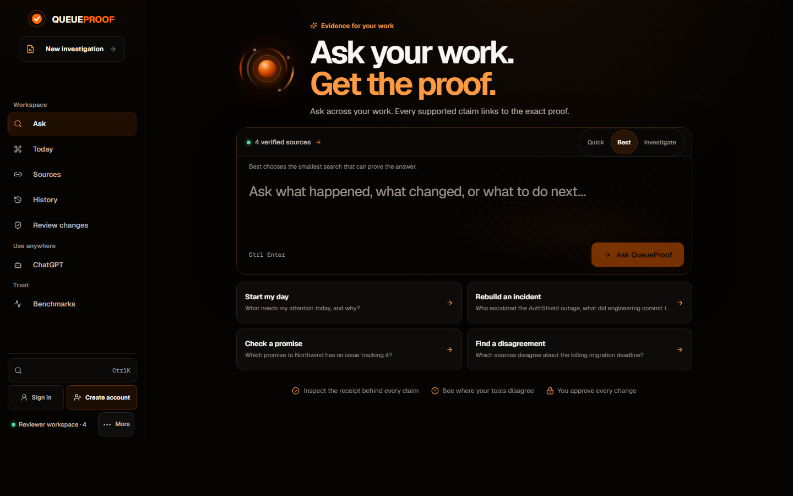
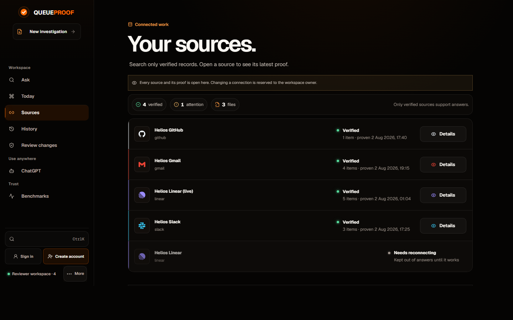
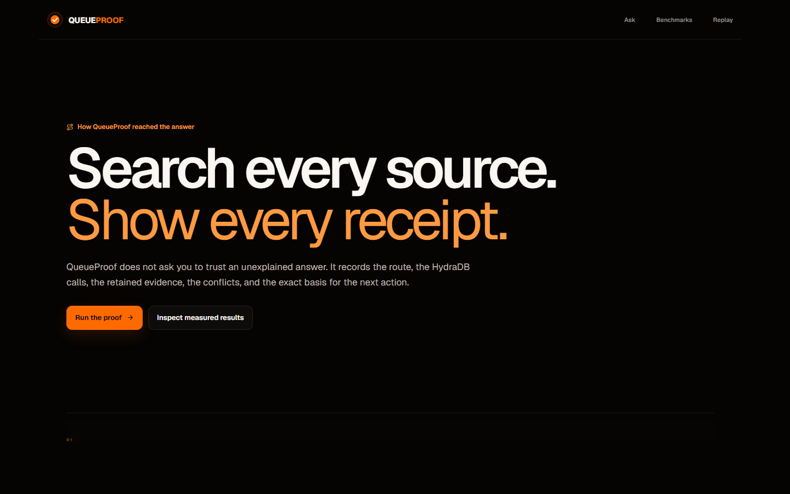

# QueueProof

**Know what needs attention, with the evidence attached.**

[](https://github.com/vaibhav4046/queueproof/actions/workflows/ci.yml)

QueueProof retrieves work evidence through HydraDB, answers cross-source questions with
claim-level citations, compiles a deterministic priority queue, and keeps external writes
behind an approval boundary. Missing evidence and source contradictions stay visible instead
of being smoothed over by the model.

- **60-second demo: <https://youtu.be/prKT-PC7NYw>**
- Product: <https://queueproof.vercel.app>
- Source: <https://github.com/vaibhav4046/queueproof>
- Method: <https://queueproof.vercel.app/method>
- Measured results: <https://queueproof.vercel.app/benchmarks>
- MCP session receipts: [docs/MCP_SESSION.md](docs/MCP_SESSION.md)
- Candidate and release receipt: [RELEASE_EVIDENCE.md](RELEASE_EVIDENCE.md)
- 60-second walkthrough script: [docs/DEMO_SCRIPT_60S.md](docs/DEMO_SCRIPT_60S.md)
- Submission copy: [docs/SUBMISSION_COPY.md](docs/SUBMISSION_COPY.md)

## The product

Ask one question across the tools a team already uses, and get an answer where every claim
opens to the record it came from.



A source is only allowed into retrieval after HydraDB returns records that are attributable to
its connector lineage. Degraded connectors stay visible and stay out of the denominator.



The evaluation method is published in the product, not just in this repository.



## Judge path

The product has real, shareable routes rather than hash-only panels:

| Route | Purpose |
| --- | --- |
| [`/`](https://queueproof.vercel.app/) | Ask a cited cross-source question |
| [`/queue`](https://queueproof.vercel.app/queue) | **Today** — review the ranked next-action queue |
| [`/evidence`](https://queueproof.vercel.app/evidence) | **Sources** — inspect connector and document receipts |
| [`/benchmarks`](https://queueproof.vercel.app/benchmarks) | **Proof tests** — compare measured retrieval outcomes |
| [`/replay`](https://queueproof.vercel.app/replay) | **History** — revisit questions and replay stored benchmark artifacts |
| [`/approvals`](https://queueproof.vercel.app/approvals) | **Review actions** — inspect proposed writes before execution |
| [`/developer`](https://queueproof.vercel.app/developer) | **Connect AI** — configure MCP clients and inspect the integration contract |
| [`/method`](https://queueproof.vercel.app/method) | Read the evaluation and trust methodology |

Start with **Ask**, open a citation receipt, then inspect the same source under **Sources**.
The **Proof tests** page publishes failures as `REVIEW`; it does not relabel them as passes.

## What is implemented

1. A connector becomes retrieval-eligible only after HydraDB returns attributable records
   and QueueProof stores a proof receipt.
2. The query planner selects fast or thinking retrieval. Identifier-heavy questions can use
   parallel lexical and hybrid lanes before evidence is merged and deduplicated.
3. Answer claims point to stored receipts. Partial answers and abstentions expose what is
   missing, while conflicting source statements remain distinct.
4. Queue items are clustered without merging unrelated exact IDs, then scored by a pure,
   versioned ranking policy.
5. Execution packets carry evidence, constraints, score components, permissions, and a
   receipt hash.
6. Provider writes begin as proposals. Approval and a database-backed at-most-once claim are
   required before execution.

## Current-release measurements

QueueProof never carries benchmark numbers forward from an older deployment. The running
release identifies itself at [`/api/health/live`](https://queueproof.vercel.app/api/health/live),
and [`/api/lab`](https://queueproof.vercel.app/api/lab) publishes results only when an artifact
is verified against that exact commit SHA.

A result is submission-safe only when all of these are true:

1. `health.release.commitSha` is present and `health.release.target` is `production`.
2. `lab.results.currentRelease.commitSha` equals the health SHA.
3. The relevant result has `status: "measured"`, contains non-empty cases, and identifies the
   same release.
4. Fast versus Thinking is quoted only when `modeComparison.comparable` is `true`.

If a current-release artifact is missing, the product says
`awaiting_current_release_measurement` instead of displaying a historical score. Judges and
recorders should read exact pass counts, fact recall, latency, calls, and weighted units from
**Proof tests** on the deployed release. `REVIEW` remains a failed strict requirement.

The deterministic router suite is intentionally separate from live retrieval. Weighted units
compare relative query work; they are not dollars. See [connector proof](docs/CONNECTOR_PROOF.md),
[large-PDF proof](docs/LARGE_PDF_PROOF.md), and the
[evaluation methodology](docs/EVALUATION_METHODOLOGY.md).

## Public and owner boundaries

The public deployment remains a shared, read-oriented judge workspace. Visitors can inspect
receipts, ask bounded questions, and review queue packets. **Sign in** and **Create account** use
the branded Supabase magic-link flow; each external subject is provisioned a deterministic private QueueProof workspace whose
sources, documents, receipts, queue, and MCP clients are isolated from every other account.

Credential configuration, connector mutation, document uploads, proposal history, approvals,
MCP administration, and external writes require an authenticated workspace owner. The historic
[`/owner`](https://queueproof.vercel.app/owner) access-token flow is a transition path only and can
be used during hybrid development. A complete production Supabase configuration resolves to
Supabase-only web identity and disables legacy owner sign-in when the selectors are omitted; explicit
production `hybrid`, `legacy`, or legacy-enabled settings fail startup validation. Set
`QUEUEPROOF_AUTH_MODE=supabase` and `QUEUEPROOF_LEGACY_OWNER_SIGNIN=false` in Vercel when you want that
policy visible in deployment configuration. Only the Supabase publishable key reaches browser
JavaScript; service-role credentials and legacy session secrets do not.

`QUEUEPROOF_PUBLIC_WORKSPACE_ID` selects the exact public workspace, which must also contain an
explicit `user:public-access` membership. If either is missing, QueueProof fails closed instead of
guessing which tenant to expose—even when the database has only one workspace. Public queries are
rate-limited. Secrets are encrypted at rest and are never returned by the API.

Provision that membership once from a trusted operator shell with the production Turso variables
already loaded (standalone scripts do not automatically load `.env.local`):

```bash
pnpm public:provision -- --workspace ws_<exact-existing-id>
```

The command verifies the workspace exists, atomically upserts only the fixed public user and a
non-owner `member` role, records an audit event, and is safe to repeat. It never creates a
workspace and is never called by a request. Then set `QUEUEPROOF_PUBLIC_ACCESS=true` and the same
`QUEUEPROOF_PUBLIC_WORKSPACE_ID`, redeploy, and keep the exact workspace assertion in the release
gate. See [public workspace provisioning](docs/PUBLIC_WORKSPACE_PROVISIONING.md).

## Architecture

```mermaid
flowchart LR
  subgraph Sources
    SL[Slack]
    GH[GitHub]
    LI[Linear]
    GM[Gmail]
    DOC[Documents<br/>346-page PDF]
  end

  subgraph HydraDB
    CAT[Connector catalogue<br/>and lifecycle]
    IDX[Document indexing]
    RET[Fast / Thinking<br/>retrieval]
  end

  subgraph QueueProof
    PROOF[Connector proof gate<br/>attributable records only]
    PLAN[Query planner<br/>exact-ID + hybrid lanes]
    MERGE[Evidence merge<br/>dedupe and clustering]
    SYN[Claim-level synthesis<br/>citations, contradictions,<br/>missing information]
    RANK[Deterministic ranking<br/>versioned policy]
    APPR[Approval boundary<br/>at-most-once execution]
  end

  subgraph Surfaces
    WEB[Web workspace]
    MCP[MCP endpoint]
    LAB[/api/lab<br/>release-bound artifacts]
  end

  SL & GH & LI & GM --> CAT
  DOC --> IDX
  CAT --> PROOF
  IDX --> PROOF
  PROOF --> PLAN --> RET --> MERGE --> SYN
  SYN --> RANK --> APPR
  SYN --> WEB
  SYN --> MCP
  RANK --> WEB
  APPR -->|owner approval required| SL
  APPR -->|owner approval required| LI
  WEB --- LAB

  TURSO[(Turso / libSQL<br/>receipts, packets,<br/>approvals, audit)]
  SYN --- TURSO
  APPR --- TURSO
  PROOF --- TURSO
```

Evidence flows one way — sources into HydraDB, HydraDB into retrieval, retrieval into cited
claims — and the only path back out to a provider runs through the approval boundary.

| Layer | Responsibility |
| --- | --- |
| Next.js 16 / React 19 | Product shell, API routes, and public/private boundaries |
| HydraDB | Provider catalogue, connector lifecycle, retrieval, and document indexing |
| Turso / libSQL | Durable workspace, receipt, queue, approval, execution, and audit state |
| `packages/retrieval` | Query planning, exact-ID lanes, and evidence normalization |
| `packages/ranking` | Pure, versioned priority scoring and explanations |
| `packages/actions` | Typed provider payloads, risk classification, and execution claims |
| MCP | Scoped agent access to the same workspace-bound product records |

Read [the architecture](docs/ARCHITECTURE.md) and [security model](docs/SECURITY.md) for the
data flow and trust boundaries.

## Run locally

Requirements:

- Node.js 22.13 or newer
- pnpm 10.33.0 (declared in `package.json`)

```bash
corepack enable
pnpm install --frozen-lockfile
```

Copy `.env.example` to `.env.local`. For local-only development, the minimum configuration is:

```dotenv
QUEUEPROOF_ENCRYPTION_KEY=<at-least-32-random-characters>
QUEUEPROOF_ALLOW_LOCAL_IDENTITY=true
QUEUEPROOF_SQLITE_PATH=.data/queueproof.db
QUEUEPROOF_TEST_MODE=false
```

Then start the development server:

```bash
pnpm dev
```

For hosted storage, set `TURSO_DATABASE_URL` and `TURSO_AUTH_TOKEN` instead of
`QUEUEPROOF_SQLITE_PATH`. Add HydraDB credentials through the private Sources UI; do not commit
them to an environment file. `LINEAR_API_KEY` is optional and must be paired with
`QUEUEPROOF_LINEAR_EXECUTION_WORKSPACE_ID`; the deployment-wide key can execute only for that
exact workspace and only for the stable deployment-owner actor. Supabase personal workspaces never
inherit it. A hosted production multi-user deployment uses `NEXT_PUBLIC_SUPABASE_URL` and
`NEXT_PUBLIC_SUPABASE_PUBLISHABLE_KEY`. With the web-auth selectors omitted, the complete production set resolves to `supabase` and disables legacy
owner sign-in; explicit unsafe production modes are rejected. Setting
`QUEUEPROOF_AUTH_MODE=supabase` and `QUEUEPROOF_LEGACY_OWNER_SIGNIN=false` remains the clearest
operator-visible configuration. Hybrid mode remains available only for deliberate development
migrations. Never commit those values. See
[remote MCP setup](docs/REMOTE_MCP_SETUP.md) for Supabase OAuth-server and ChatGPT setup.
The complete provider configuration is in [Supabase authentication setup](docs/SUPABASE_AUTH_SETUP.md).

## Claude Code plugin

The repository ships a plugin manifest (`.claude-plugin/`) whose MCP server is the public
read-only demo endpoint, so it works with zero credentials:

```bash
claude plugin marketplace add vaibhav4046/queueproof
```

Then inside Claude Code run `/plugin install queueproof@queueproof`. The plugin registers the
`queueproof-demo` HTTP server (`https://queueproof.vercel.app/mcp/demo`), which exposes the
read-only `queueproof_search` tool against the synthetic Helios workspace. It cannot read
personal data, sync connectors, or write anywhere. This is a repository-based install;
QueueProof is not claimed to be listed in any public plugin directory. For a local checkout,
`claude --plugin-dir .` loads the same manifest. Authenticated access to a personal workspace
uses the project MCP configuration in [remote MCP setup](docs/REMOTE_MCP_SETUP.md), not the
plugin.

## Verify

The pull-request CI workflow installs the committed lockfile and runs these deterministic
gates on Node.js 22.13:

```bash
pnpm audit:dependencies
pnpm scan:secrets
pnpm typecheck
pnpm lint
pnpm test
pnpm benchmark:router
pnpm build
pnpm deploy:check
```

`pnpm build` is the exact native Next.js webpack build used by Vercel. The historical
Cloudflare/vinext compatibility build remains available as `pnpm build:cloudflare`; it is not a
substitute for the production gate.

For local shell acceptance, start the built app in one terminal and run the check in another:

```bash
pnpm start
pnpm test:e2e
```

Live benchmarks are deliberately separate from CI because they query connected provider data:

```bash
pnpm benchmark:live -- --url https://queueproof.vercel.app --mode fast
pnpm benchmark:live -- --url https://queueproof.vercel.app --mode thinking
pnpm benchmark:live -- --url https://queueproof.vercel.app --mode auto
pnpm benchmark:pdf -- --url https://queueproof.vercel.app
```

The deterministic router benchmark is not presented as live-retrieval accuracy. Replay frames
are stored artifacts, not newly executed runs. Relative query units are not converted into
invented dollar costs.

## Evidence index

- [Canonical release evidence and sign-off](RELEASE_EVIDENCE.md)
- [Benchmark report](BENCHMARK_REPORT.md)
- [Evaluation methodology](docs/EVALUATION_METHODOLOGY.md)
- [Connector proof](docs/CONNECTOR_PROOF.md)
- [Large-PDF proof](docs/LARGE_PDF_PROOF.md)
- [Security model](docs/SECURITY.md)
- [Historical secret-scan receipt (superseded; CI scans each candidate commit)](audit/secret-scan-2026-08-05.md)
- [Historical dependency receipt (superseded; CI audits the current lockfile)](audit/dependency-audit-2026-08-04.md)
- [Judging matrix](docs/JUDGING_MATRIX.md)
- [Hackathon form answers](docs/HACKATHON_FORM.md)

## Honest boundaries

- Timestamped live results are a small observed sample, not an SLA.
- A `REVIEW` benchmark result is a failed strict requirement, not a partial pass.
- Live and large-document metrics are quoted only when `/api/lab` marks a same-release
  artifact as measured; otherwise the honest result is "awaiting measurement."
- Public users cannot mutate credentials, connectors, uploads, tokens, or external systems.
- A real provider write is proven only by a stored provider response identifier.
- Repository visibility must be verified in a signed-out browser before calling the source
  link public.
- Credentials previously exposed outside this repository must be rotated at their source even
  when repository secret scans are clean.

## License

[MIT](LICENSE)
